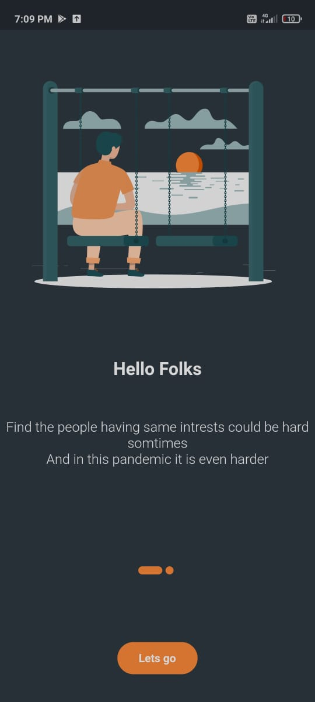
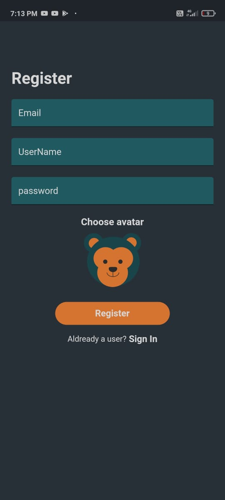
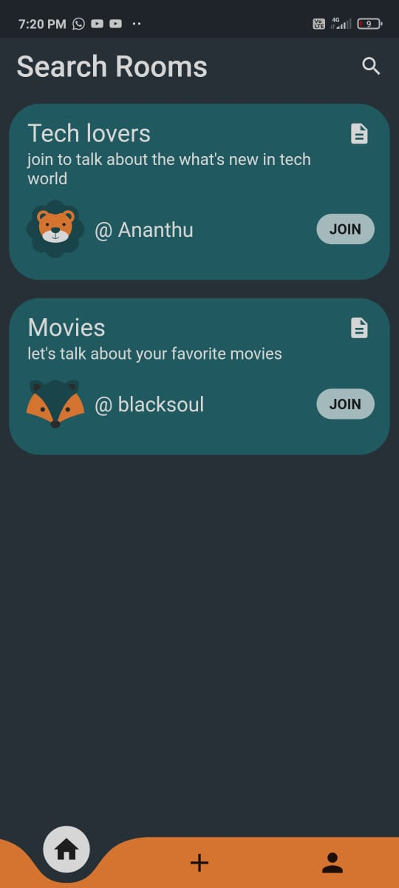
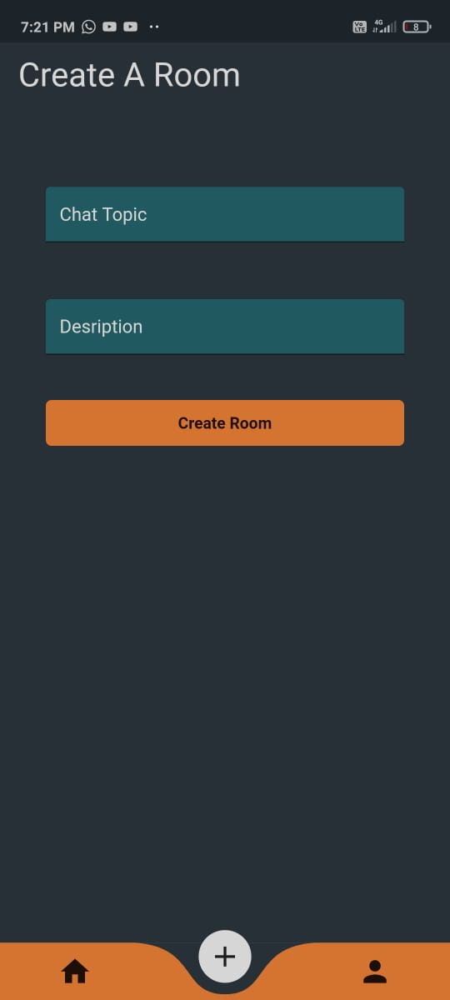

<h1 >SOULS </h1>  

 
Souls is an online chat room app where random strangers can anonymously meet from around the world and have fun.
 There are aldready somany application with the same concept but in souls the room need to be crated by a user with specific topic which will shows to other users if there intrsted in talking about the topic they can join it. As it will lower the confusion having commonly in stranger videochat.

 
 

 
  
   

